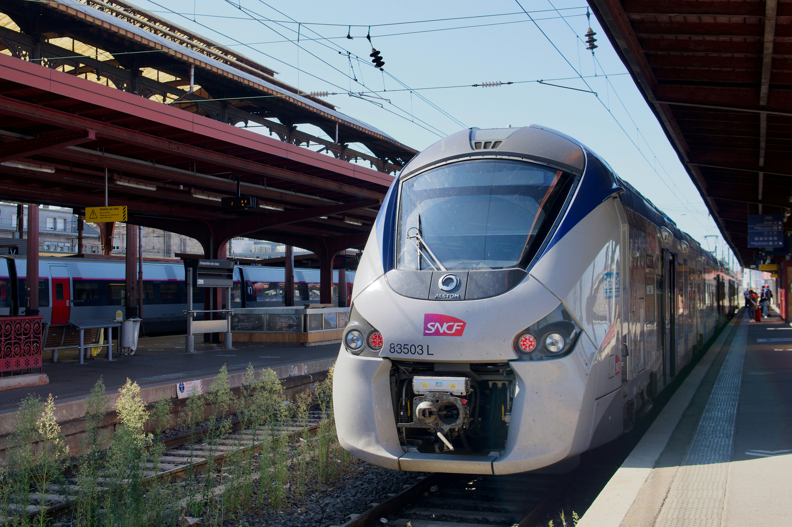

# Introduction to ggplot2
Reiko Okamoto
2024-09-13

## 🎨Introduction to ggplot2

ggplot2 helps us create a wide range of static, informative, and
visually appealing graphics. Its name comes from the Grammar of
Graphics, which is a framework for building plots in a structured way.
We can build a plot incrementally by adding layers like data points,
axes, colours, and labels.

💻Load the necessary packages:

``` r
library(tidyverse)
```

    ── Attaching core tidyverse packages ──────────────────────── tidyverse 2.0.0 ──
    ✔ dplyr     1.1.4     ✔ readr     2.1.5
    ✔ forcats   1.0.0     ✔ stringr   1.5.1
    ✔ ggplot2   3.5.1     ✔ tibble    3.2.1
    ✔ lubridate 1.9.3     ✔ tidyr     1.3.1
    ✔ purrr     1.0.2     
    ── Conflicts ────────────────────────────────────────── tidyverse_conflicts() ──
    ✖ dplyr::filter() masks stats::filter()
    ✖ dplyr::lag()    masks stats::lag()
    ℹ Use the conflicted package (<http://conflicted.r-lib.org/>) to force all conflicts to become errors

``` r
library(RColorBrewer)
```

## 1️⃣Explore the sample data



We’ll use a data set sourced from a [GitHub
repository](https://github.com/rfordatascience/tidytuesday/tree/master/data/2019/2019-02-26),
which originally retrieved the data from the SNCF open data portal.
SCNF, founded in 1938, is France’s national railway company. It operates
systems like the TGV high-speed trains and regional TER services.

💻Read in the data using the
[`read_csv()`](https://readr.tidyverse.org/reference/read_delim.html)
function from the [readr](https://readr.tidyverse.org/) package:

``` r
trains_df <- read_csv(here::here("french_trains.csv"))
```

    Rows: 5462 Columns: 11
    ── Column specification ────────────────────────────────────────────────────────
    Delimiter: ","
    chr (3): service, departure_station, arrival_station
    dbl (8): year, month, journey_time_avg, total_num_trips, avg_delay_all_depar...

    ℹ Use `spec()` to retrieve the full column specification for this data.
    ℹ Specify the column types or set `show_col_types = FALSE` to quiet this message.

``` r
trains_df
```

    # A tibble: 5,462 × 11
        year month service  departure_station       arrival_station journey_time_avg
       <dbl> <dbl> <chr>    <chr>                   <chr>                      <dbl>
     1  2015     1 National AIX EN PROVENCE TGV     PARIS LYON                 182. 
     2  2015     1 National ANGERS SAINT LAUD       PARIS MONTPARN…             98.9
     3  2015     1 National ANGOULEME               PARIS MONTPARN…            156. 
     4  2015     1 National ANNECY                  PARIS LYON                 224. 
     5  2015     1 National ARRAS                   PARIS NORD                  55.6
     6  2015     1 National AVIGNON TGV             PARIS LYON                 161. 
     7  2015     1 National BELLEGARDE (AIN)        PARIS LYON                 164. 
     8  2015     1 National BESANCON FRANCHE COMTE… PARIS LYON                 131. 
     9  2015     1 National BORDEAUX ST JEAN        PARIS MONTPARN…            211. 
    10  2015     1 National BREST                   PARIS MONTPARN…            274. 
    # ℹ 5,452 more rows
    # ℹ 5 more variables: total_num_trips <dbl>, avg_delay_all_departing <dbl>,
    #   avg_delay_all_arriving <dbl>, num_late_at_departure <dbl>,
    #   num_arriving_late <dbl>

🧠Explore the type and description of each variable:

| Variable                  | Type      | Description                          |
|---------------------------|-----------|--------------------------------------|
| `year`                    | double    | Year of observation                  |
| `month`                   | double    | Month of observation                 |
| `service`                 | character | Type of service                      |
| `departure_station`       | character | Departure station                    |
| `arrival_station`         | character | Arrival station                      |
| `journey_time_avg`        | double    | Average journey time (in minutes)    |
| `total_num_trips`         | double    | Total number of trips recorded       |
| `avg_delay_all_departing` | double    | Average departure delay (in minutes) |
| `avg_delay_all_arriving`  | double    | Average arrival delay (in minutes)   |
| `num_late_at_departure`   | double    | Number of trains that departed late  |
| `num_arriving_late`       | double    | Number of trains that arrived late   |

The data set contains **monthly summaries** of train journeys from 2015
to 2018. Each row represents aggregated data for a specific route and
month, including average journey times, delays, and the total number of
trips. This structure will allow us to explore trends over time and
visualize overall patterns in train travel.

💻Inspect the first and last parts of the data set:

``` r
head(trains_df)
```

    # A tibble: 6 × 11
       year month service  departure_station   arrival_station    journey_time_avg
      <dbl> <dbl> <chr>    <chr>               <chr>                         <dbl>
    1  2015     1 National AIX EN PROVENCE TGV PARIS LYON                    182. 
    2  2015     1 National ANGERS SAINT LAUD   PARIS MONTPARNASSE             98.9
    3  2015     1 National ANGOULEME           PARIS MONTPARNASSE            156. 
    4  2015     1 National ANNECY              PARIS LYON                    224. 
    5  2015     1 National ARRAS               PARIS NORD                     55.6
    6  2015     1 National AVIGNON TGV         PARIS LYON                    161. 
    # ℹ 5 more variables: total_num_trips <dbl>, avg_delay_all_departing <dbl>,
    #   avg_delay_all_arriving <dbl>, num_late_at_departure <dbl>,
    #   num_arriving_late <dbl>

``` r
tail(trains_df)
```

    # A tibble: 6 × 11
       year month service departure_station  arrival_station      journey_time_avg
      <dbl> <dbl> <chr>   <chr>              <chr>                           <dbl>
    1  2018    11 <NA>    TOURCOING          BORDEAUX ST JEAN                285. 
    2  2018    11 <NA>    TOURCOING          MARSEILLE ST CHARLES            305. 
    3  2018    11 <NA>    TOURS              PARIS MONTPARNASSE               76.9
    4  2018    11 <NA>    VALENCE ALIXAN TGV PARIS LYON                      133. 
    5  2018    11 <NA>    VANNES             PARIS MONTPARNASSE              157. 
    6  2018    11 <NA>    ZURICH             PARIS LYON                      242. 
    # ℹ 5 more variables: total_num_trips <dbl>, avg_delay_all_departing <dbl>,
    #   avg_delay_all_arriving <dbl>, num_late_at_departure <dbl>,
    #   num_arriving_late <dbl>

- The first row captures information on trips from “AIX EN PROVENCE TGV”
  to “PARIS LYON” for the month of January 2015

- The last row captures information on trips from “ZURICH” to “PARIS
  LYON” for the month of November 2018

## 2️⃣Histograms

💻Create a histogram to visualize the distribution of average journey
time:

``` r
ggplot(trains_df, aes(x = journey_time_avg)) +
  geom_histogram(bins = 20)
```


We can see that the distribution of average journey time is
right-skewed.

Breaking down the code:

- The first argument in
  [`ggplot()`](https://ggplot2.tidyverse.org/reference/ggplot.html)
  indicates which data frame we want to use.

- The second argument, called the aesthetic mapping, specifies how the
  columns of the data frame should be mapped to different parts of the
  plot (e.g., x-axis, y-axis, colour, etc.).

- We use the `+` operator to add each layer to the plot.

- [`geom_histogram()`](https://ggplot2.tidyverse.org/reference/geom_histogram.html)
  is a geometric object (or “geom”) that decides how the mapped data is
  displayed—in this case, as a histogram.

## 3️⃣Scatter plots

Scatter plots are a powerful way to visualize the relationship between
two continuous variables.

💻Create a scatter plot to visualize the relationship between the
average journey time and the number of trains that departed late:

``` r
trains_df |> 
  ggplot(aes(x = journey_time_avg, y = num_late_at_departure)) +
  geom_point()
```


Sometimes, when data points overlap too much, it can be challenging to
see the individual points. This is called overplotting.

💻To address this, adjust the transparency of the points using the
`alpha` argument:

``` r
trains_df |> 
  ggplot(aes(x = journey_time_avg, y = num_late_at_departure)) +
  geom_point(alpha = 0.2)
```


💻Make the plot more visually appealing by changing the colour of the
points and adding a title and axis labels:

``` r
trains_df |> 
  ggplot(aes(x = journey_time_avg, y = num_late_at_departure)) +
  geom_point(alpha = 0.2, colour = "#3182bd") +
  labs(
    title = "French train punctuality",
    x = "Average journey time (minutes)",
    y = "Number of trains that departed late"
  )
```


#### 📝**Exercise 1**

Create a scatter plot to visualize the relationship between two other
continuous variables in the data. This time, change the default size of
the points by using the `size` argument. The default size is 1.5, but we
can increase or decrease this value to make the points bigger or
smaller.

``` r
trains_df |> 
  ggplot(aes(x = total_num_trips, y = num_late_at_departure)) +
  geom_point(size = 0.1)
```


## 4️⃣Bar plots

Bar plots are also commonly used in data analysis. They are particular
useful for comparing values between different groups.

💻Create a bar plot to show the number of departures from “PARIS NORD”
in 2015 by arrival station:

``` r
trains_df |> 
  filter(departure_station == "PARIS NORD",
         year == 2015) |> 
  group_by(arrival_station) |> 
  summarise(n = sum(total_num_trips)) |> 
  ggplot(aes(x = arrival_station, y = n)) +
  geom_bar(stat = "identity")
```


Here, `stat = "identity"` tells ggplot2 to take the `n` column as it is
and use it for the height of the bars.

💻Create a grouped bar plot to compare the number of departures from
“PARIS NORD” in 2015 and 2016, by arrival station:

``` r
paris_1516_plt <- trains_df |> 
  filter(departure_station == "PARIS NORD", 
         year %in% c(2015, 2016)) |>
  mutate(year = as.factor(year)) |> 
  group_by(year, arrival_station) |> 
  summarise(n = sum(total_num_trips), .groups = "drop") |> 
  ggplot(aes(x = arrival_station, y = n, fill = year)) +
  geom_bar(stat = "identity", position = "dodge")
```

Breaking down the code:

- `as.factor(year)` changes the `year` variable from a numeric type to a
  categorical one, ensuring each year gets a distinct colour

- The `fill` argument in `aes()` maps the `year` variable to the fill
  colour of the bars

- `position = "dodge"` arranges the bars of the different years side by
  side within each `arrival_station` category, making it easier to
  compare values across years

💻Customize fill colours manually:

``` r
paris_1516_plt +
  scale_fill_manual(values = c("2015" = "gold", "2016" = "royalblue"))
```


Pre-made colour palettes, such as those from the
[RColorBrewer](https://r-graph-gallery.com/38-rcolorbrewers-palettes.html)
package, offer a variety of well-tested colour schemes that are often
aesthetically pleasing. These palettes are useful for ensuring good
contrast and consistency across visualizations.

💻Display available palettes:

``` r
display.brewer.all()
```


💻Pick and apply a qualitative palette from RColorBrewer:

``` r
paris_1516_plt +
  scale_fill_brewer(palette = "Accent")
```


In ggplot2, the `scale_{aesthetic}_{type}()` functions control how data
values are mapped to aesthetic properties like colour and fill.

The `scale_fill_{type}()` functions adjust fill colours in plots where
the `fill` aesthetic is mapped to a variable, such as in bar and box
plots.

On the other hand, `scale_colour_{type}()` functions are used to adjust
the colours of lines, points, or borders in plots where the `colour`
aesthetic is mapped to a variable.

#### 📝Exercise 2

Create a bar plot to show the number of departures from “NANTES” in 2018
by arrival station. Use the
[`scale_fill_brewer()`](https://ggplot2.tidyverse.org/reference/scale_brewer.html)
function to apply a qualitative palette accessible to colorblind
viewers. Hint: You can call `display.brewer.allcolorblindFriendly=TRUE)`
to retrieve a list of appropriate palettes.

``` r
trains_df |> 
  filter(departure_station == "NANTES",
         year == 2018) |> 
  group_by(arrival_station) |> 
  summarise(n = sum(total_num_trips)) |> 
  ggplot(aes(x = arrival_station, y = n, fill = arrival_station)) +
  geom_bar(stat = "identity") +
  scale_fill_brewer(palette = "Paired") 
```


## 5️⃣Line plots

Line plots are useful in data analysis for visualizing trends over time.

💻Create a date column:

``` r
trains_df <- trains_df |> 
  mutate(date = make_date(year, month, "1"))
```

💻Create a line plot to show how the monthly number of trips from “PARIS
MONTPARNASSE” to “BREST” fluctuates over time:

``` r
trains_df |> 
  filter(departure_station == "PARIS MONTPARNASSE",
         arrival_station == "BREST") |> 
  ggplot(aes(x = date, y = total_num_trips)) +
  geom_line()
```


Instead of working with separate `year` and `month` columns, we create a
single date column in the format `yyyy-mm–01` to handle the continuous
time data. This results in smoother scaling, correct chronological
ordering, and more precise formatting of the axis labels, making the
time-based trends much cleaner.

💻Create a line plot to show how the monthly number of trips from “PARIS
MONTPARNASSE” to multiple cities in Brittany (i.e., “RENNES”, “BREST”,
“QUIMPER”) fluctuates throughout the year:

``` r
cities <- c("RENNES", "BREST", "QUIMPER")

brittany_plt <- trains_df |> 
  filter(departure_station == "PARIS MONTPARNASSE",
         arrival_station %in% cities) |> 
  ggplot(aes(x = date, y = total_num_trips, colour = arrival_station)) +
  geom_line()
```

The `colour` argument in `aes()` maps the `arrival_station` variable to
the line colours.

Fun fact: Rennes has the most frequent service because trains departing
from Paris often separate in Rennes, with the first part going to Brest
and the latter to Quimper (see map below).


💻Enhance the existing line plot by by making the x-axis labels more
detailed:

``` r
brittany_plt <- brittany_plt +
  scale_x_date(date_labels = "%b %Y", date_breaks = "4 months")
```

The `date_labels` argument allows us to customize the format to show
both the month and the year, while `date_breaks` sets the interval for
the labels to appear every 4 months.

The `scale_x_{type}()` and `scale_y_{type}` functions allow us to
customize how our data is represented on the axes. In addition to
adjusting the label formats and placing breaks at specific intervals, it
is also possible to transform scale transformations (e.g., log
transformation) to better represent the data.

💻Further enhance the line plot by applying a different theme to change
its overall look and feel:

``` r
brittany_plt +
  theme_minimal()
```


ggplot2 offers [various
themes](https://ggplot2.tidyverse.org/reference/ggtheme.html) that we
can use to match the style we’re aiming for.

## 6️⃣Saving our plots

``` r
ggsave(filename = "brittany.png", plot = brittany_plt)
```

    Saving 7 x 5 in image

If we don’t specify the `plot` argument, the function will save the last
plot displayed by default.

## 📚Resources

- <https://www.data-to-viz.com/>

- <http://www.sthda.com/english/wiki/be-awesome-in-ggplot2-a-practical-guide-to-be-highly-effective-r-software-and-data-visualization>

- <https://ggplot2.tidyverse.org/reference/>
