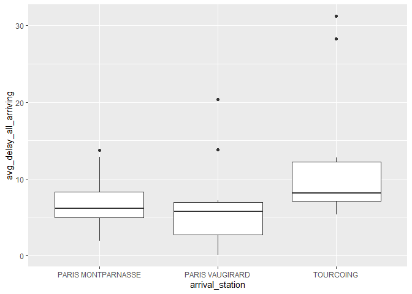
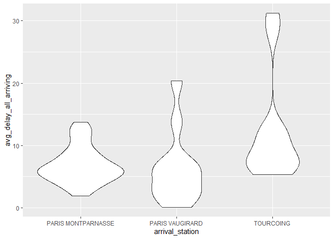
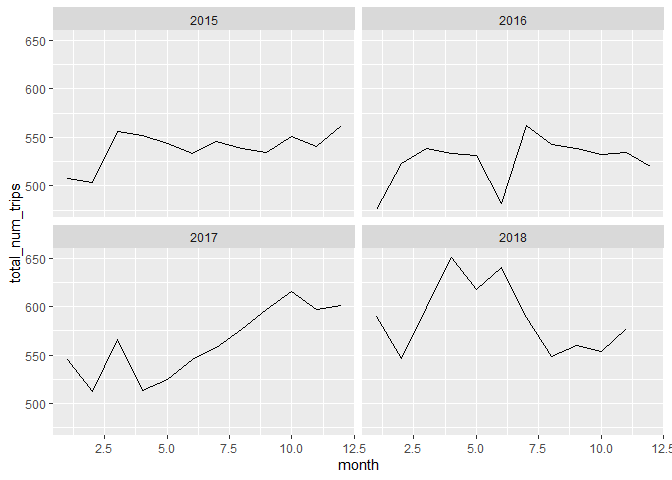
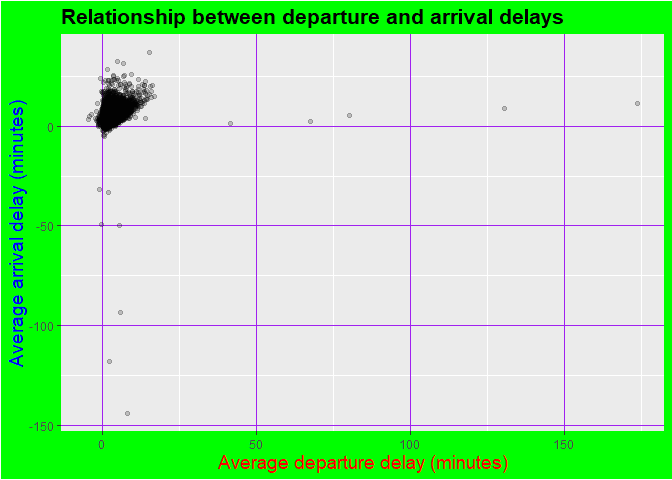

# More ggplot2
Reiko Okamoto
2024-08-22

I can only fit so much into a three-hour workshop! In this document,
we’ll use the same data set of French train delays to explore additional
features of ggplot2.

💻Load the necessary packages:

``` r
library(tidyverse)
```

    ── Attaching core tidyverse packages ──────────────────────── tidyverse 2.0.0 ──
    ✔ dplyr     1.1.4     ✔ readr     2.1.5
    ✔ forcats   1.0.0     ✔ stringr   1.5.1
    ✔ ggplot2   3.5.1     ✔ tibble    3.2.1
    ✔ lubridate 1.9.3     ✔ tidyr     1.3.1
    ✔ purrr     1.0.2     
    ── Conflicts ────────────────────────────────────────── tidyverse_conflicts() ──
    ✖ dplyr::filter() masks stats::filter()
    ✖ dplyr::lag()    masks stats::lag()
    ℹ Use the conflicted package (<http://conflicted.r-lib.org/>) to force all conflicts to become errors

💻Read in the data:

``` r
trains_df <- read_csv(here::here("french_trains.csv"))
```

    Rows: 5462 Columns: 11
    ── Column specification ────────────────────────────────────────────────────────
    Delimiter: ","
    chr (3): service, departure_station, arrival_station
    dbl (8): year, month, journey_time_avg, total_num_trips, avg_delay_all_depar...

    ℹ Use `spec()` to retrieve the full column specification for this data.
    ℹ Specify the column types or set `show_col_types = FALSE` to quiet this message.

``` r
trains_df
```

    # A tibble: 5,462 × 11
        year month service  departure_station       arrival_station journey_time_avg
       <dbl> <dbl> <chr>    <chr>                   <chr>                      <dbl>
     1  2015     1 National AIX EN PROVENCE TGV     PARIS LYON                 182. 
     2  2015     1 National ANGERS SAINT LAUD       PARIS MONTPARN…             98.9
     3  2015     1 National ANGOULEME               PARIS MONTPARN…            156. 
     4  2015     1 National ANNECY                  PARIS LYON                 224. 
     5  2015     1 National ARRAS                   PARIS NORD                  55.6
     6  2015     1 National AVIGNON TGV             PARIS LYON                 161. 
     7  2015     1 National BELLEGARDE (AIN)        PARIS LYON                 164. 
     8  2015     1 National BESANCON FRANCHE COMTE… PARIS LYON                 131. 
     9  2015     1 National BORDEAUX ST JEAN        PARIS MONTPARN…            211. 
    10  2015     1 National BREST                   PARIS MONTPARN…            274. 
    # ℹ 5,452 more rows
    # ℹ 5 more variables: total_num_trips <dbl>, avg_delay_all_departing <dbl>,
    #   avg_delay_all_arriving <dbl>, num_late_at_departure <dbl>,
    #   num_arriving_late <dbl>

## 📈Box plots

Box plots are great for visualizing the distribution of a continuous
variable across different categories.

💻Create a box plot to show the distribution of average arrival delay
across different journeys from “BORDEAUX ST JEAN”:

``` r
trains_df |> 
  filter(departure_station == "BORDEAUX ST JEAN") |> 
  ggplot(aes(x = arrival_station, y = avg_delay_all_arriving)) +
  geom_boxplot()
```



## 📈Violin plots

Violin plots are similar to box plots. However, violin plots reveal the
full data distribution, unlike box plots, which only highly summary
statistics like the median and interquartile range. This is especially
helpful when the data has multiple peaks (i.e., multimodal
distribution).

💻Create a violin plot to show the distribution of average arrival delay
across different journeys from “BORDEAUX ST JEAN”:

``` r
trains_df |> 
  filter(departure_station == "BORDEAUX ST JEAN") |> 
  ggplot(aes(x = arrival_station, y = avg_delay_all_arriving)) +
  geom_violin()
```



Note that we only had to change one line of code!

## 📈Facet plots

Facets allow us to break down a plot into smaller, related subplots.

💻Create a line plot to show how the monthly number of trips from “PARIS
MONTPARNASSE” to “RENNES” fluctuates over time. Use facets to organize
the subplots by year, with a separate panel for each year:

``` r
trains_df |> 
  filter(departure_station == "PARIS MONTPARNASSE",
         arrival_station == "RENNES") |> 
  ggplot(aes(x = month, y = total_num_trips)) +
  geom_line() +
  facet_wrap(~year)
```



## 📈Modify components of a theme

Theme elements are non-data components of a plot, which include things
like the background colour, text size, font, and grid lines. These
changes don’t alter the underlying data; rather, they adjust the
appearance of the plot.

💻Create a base plot:

``` r
plt <- trains_df |> 
  ggplot(aes(x = avg_delay_all_departing, 
             y = avg_delay_all_arriving)) +
  geom_point(alpha = 0.2) +
  labs(
    title = "Relationship between departure and arrival delays",
    x = "Average departure delay (minutes)",
    y = "Average arrival delay (minutes)"
  )
```

💻Modify the look and feel of your plot using the
[`theme()`](https://ggplot2.tidyverse.org/reference/theme.html)
function:

``` r
plt +
  theme(
    plot.title = element_text(face = "bold", size = 16),    # Bold and larger title
    axis.title.x = element_text(size = 14, color = "red"),  # Red color and larger x-axis label
    axis.title.y = element_text(size = 14, color = "blue"), # Blue color and larger y-axis label
    plot.background = element_rect(fill = "green"),    # Green background
    panel.grid.major = element_line(color = "purple", size = 0.5) # Purple gridlines
  )
```

    Warning: The `size` argument of `element_line()` is deprecated as of ggplot2 3.4.0.
    ℹ Please use the `linewidth` argument instead.



Note: In no way do I think this aesthetic makes the plot more visually
appealing or easier to read. However, I hope it demonstrates just how
customizable ggplot2 is 🤠 For more information on what you can modify,
check out this link:
<https://ggplot2-book.org/themes#modifying-theme-components>
